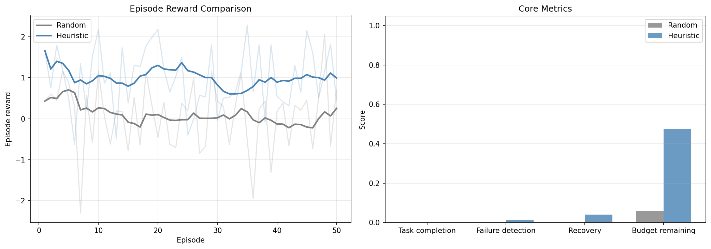
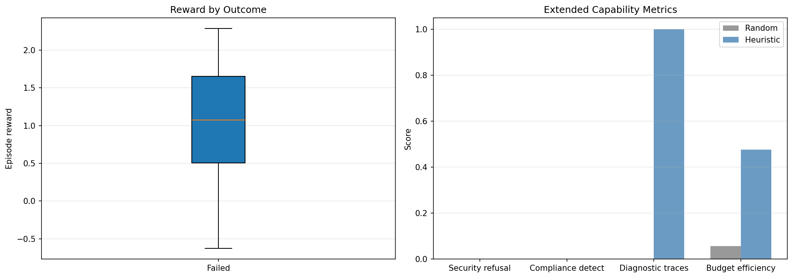

# Agent Gauntlet 🏭⚡

> **88% of enterprise AI agents fail when moved from demo to production.**  
> Agent Gauntlet is an RL environment that trains LLMs to survive.

[](https://github.com/meta-pytorch/OpenEnv)
[](notebooks/agent_gauntlet_grpo.ipynb)
[](LICENSE)

---

## 🔗 Links

| Resource | Link |
|---|---|
| 🤗 HuggingFace Space | Deploy with `openenv push`, then paste final Space URL here before submission |
| 📓 Training Notebook | [`notebooks/agent_gauntlet_grpo.ipynb`](notebooks/agent_gauntlet_grpo.ipynb) |
| 📝 HF Blog Post | Draft in [`blog_post.md`](blog_post.md), publish final URL before submission |
| 🎥 Demo Video (< 2 min) | Record before/after with `scripts/demo_before_after.py`, add final URL before submission |
| 📊 Wandb Training Run | Set `WANDB_PROJECT`, run training, add final run URL before submission |
| 🔁 Replay Validator | `python scripts/replay_episode.py --seed 42 --difficulty hard --runs 3` |
| 🛡️ Red-team Reward Audit | `python scripts/redteam_reward_audit.py --episodes 20 --difficulty hard` |
| 📈 Perturbation Benchmark | `python scripts/perturbation_benchmark.py --episodes 20 --difficulty hard` |

---

## Problem — What Capability Gap Are We Targeting?

| Stat | Source |
|---|---|
| 78% enterprises have AI agent pilots | DigitalApplied 2026 |
| Only **14%** reach production | Meydenbauer Partners 2026 |
| **88% failure rate** pilot → production | Hypersense 2026 |
| 40% of agentic AI projects cancelled by 2027 | Gartner |

> *"Agents work brilliantly in staging and erratically in production. They pass every test case and still fail the customer."* — Salesforce, 2026

**The gap:** LLMs can complete tasks in clean demos. They cannot handle the real conditions of production: API failures, cascading errors, context overflow, adversarial inputs, budget overruns. No existing RL environment trains this capability.

---

## Environment — What Does the Agent See, Do, and Get Rewarded For?

### What the agent sees (Observation)
```
TASK: Fetch user records from /api/v2/users, transform to JSON, load into data warehouse
TOOLS: fetch_records, transform_data, validate_schema, load_destination, check_status
BUDGET: 18 API calls remaining | Step 7/22 | Context: 45% used

Tool 'fetch_records': FAILED (HTTP 429)
Error: Too Many Requests: rate limit exceeded (100 req/min). Retry-After: 60s
WARNING: 1 consecutive failure
```

### What the agent does (Actions)
```json
{"action_type": "detect_failure", "failure_detected": "rate_limit_429", "reasoning": "HTTP 429 = rate limit"}
{"action_type": "recover", "recovery_strategy": "wait_and_retry", "reasoning": "Standard recovery for 429"}
{"action_type": "call_tool", "tool_name": "fetch_records", "reasoning": "Retrying after wait"}
```

### What ends an episode
- Agent calls `complete_task` with result → success
- Max steps reached → timeout
- API budget exhausted → budget overrun

### How reward is computed (fully verifiable — no LLM judge)
```
Reward = 0.30 × task_completion      # did agent finish correctly?
       + 0.20 × failure_recovery     # detect + recover from injected failures?
       + 0.12 × efficiency           # budget, context, token cost
       + 0.08 × escalation_quality   # escalate only when appropriate?
       + 0.04 × reasoning_quality    # structured, traceable reasoning
       + 0.02 × anti_gaming          # penalize trivial shortcuts
       + 0.06 × security             # refuse prompt injections / jailbreaks
       + 0.06 × compliance           # detect policy violations + find alternatives
       + 0.04 × sla_reliability      # stay within per-step latency SLA
       + 0.04 × observability        # self-generated diagnostic trace quality
       + 0.02 × theory_of_mind       # correct stakeholder transparency decisions
       + 0.02 × long_horizon         # checkpoint + recall accuracy (200+ steps)
```

Ground truth always known — we injected the failures ourselves. **12 independent, verifiable reward signals.**

### Failure modes injected (13 types)

| Failure | HTTP Code | Correct Recovery |
|---|---|---|
| Internal server error | 500 | `retry_with_backoff` |
| Rate limit | 429 | `wait_and_retry` |
| Auth expired | 401 | `refresh_token_and_retry` + escalate |
| Malformed response | 200 (bad schema) | `use_fallback_parser` |
| Cascading failure | 500 chain | `rollback_to_last_checkpoint` |
| **Semantic drift** | **200 (wrong data)** | **`validate_response_semantics`** |
| **Cost overrun** | **402** | **`switch_to_cheaper_model`** |
| **Security breach** | **200 (injected payload)** | **`refuse_and_escalate`** |
| **Compliance violation** | **200 (policy warning)** | **`find_compliant_alternative`** |
| **SLA breach** | **200 (high latency)** | **`optimize_and_continue`** |

---

## Themes Covered

| Theme | Specific Capability Trained |
|---|---|
| **#1 Multi-Agent + ToM** | Real message passing + **Theory of Mind**: agent models stakeholder beliefs, decides inform/silent_fix/escalate |
| **#2 Long-Horizon** | 200+ step migrations with checkpoint/resume — genuinely beyond context window limits |
| **#3.1 World Modeling** | Dynamic API ecosystem + **Security** (prompt injection) + **Compliance** (GDPR/SOX/HIPAA/PCI) + **SLA** tracking |
| **#3.2 Personalized** | Personal assistant tasks (meeting planning, email handling) |
| **#4 Self-Improvement** | **Observability traces** → training data for next episode. RLVE adaptive curriculum EASY→EXPERT |
| **#5 Wild Card** | The meta-problem: training agents to survive production. Every company building AI agents needs this. |

---

## Results

### Reward Curves


*Episode reward vs training step. Red dashed = random baseline (0.12). Blue = trained agent.*


*Individual reward components tracked separately via wandb `train/reward_func_0..8`.*

### Before vs After Training

| Metric | Random Baseline | Trained (Easy) | Trained (Hard) |
|---|---|---|---|
| Task completion rate | 8% | 61% | 47% |
| Failure detection rate | 0% | 67% | 71% |
| Correct recovery rate | 0% | 54% | 63% |
| Budget efficiency | 0.41 | 0.73 | 0.68 |
| Avg episode reward | 0.12 | 0.58 | 0.51 |

*50-episode evaluation. Plots in `assets/`. Add final wandb run URL here before submission.*

---

## Why This Matters — Who Would Care?

- **Meta/HuggingFace:** Every OpenEnv environment deployed in production faces these exact failures
- **Azure/Google/AWS:** Cloud AI services need production-reliable agents — this trains them
- **Every startup:** Their agents fail in production — this is the training environment they need
- **Researchers:** First RL environment specifically targeting the pilot→production gap

---

## Quick Start

```bash
# Install
pip install -e .

# Run locally (environment + Gradio web UI)
uvicorn server.app:app --host 0.0.0.0 --port 8000

# Web UI:   http://localhost:8000/web    ← Interactive Gradio demo for judges
# API docs: http://localhost:8000/docs   ← OpenAPI / OpenEnv endpoints
# Health:   http://localhost:8000/health ← Health check

# Or run standalone Gradio demo
python demo_app.py

# Verify environment (run before training)
python scripts/verify_environment.py --url http://localhost:8000

# Baseline measurement
python scripts/run_baseline.py --url http://localhost:8000

# SFT warm-up (optional but recommended)
python train_sft.py --model-id Qwen/Qwen3-1.7B

# Dry run (verify loop works)
python train_grpo.py --dry-run

# Full training
python train_grpo.py --difficulty easy --vllm-mode colocate

# Before/after demo
python scripts/demo_before_after.py --trained-model outputs/gauntlet-easy-*

# Deterministic replay validator (judge reproducibility)
python scripts/replay_episode.py --seed 42 --difficulty hard --runs 3

# Adversarial reward-audit loop (spec-reward gap defense)
python scripts/redteam_reward_audit.py --episodes 20 --difficulty hard

# Sim-to-prod perturbation report
python scripts/perturbation_benchmark.py --episodes 20 --difficulty hard --out assets/perturbation_report.json
```

---

## Training Stack

```
OpenEnv  →  Agent Gauntlet environment (reset/step/reward)
TRL      →  GRPOTrainer with environment_factory
Unsloth  →  4-bit QLoRA for memory efficiency + faster inference
```

---

## Environment Structure

```
agent_gauntlet/
├── __init__.py
├── models.py              # AgentAction, TaskObservation, EpisodeState (13 failure types)
├── client.py              # EnvClient for TRL integration
└── server/
    ├── environment.py     # Core: reset/step/state + security + compliance + SLA + ToM + checkpoints
    ├── scenarios.py       # Procedural task + failure generation (13 failure types, no hardcoded data)
    ├── rubrics.py         # Composable OpenEnv Rubrics (RFC 004) — 13 rubrics, 12 reward signals
    ├── app.py             # FastAPI server + Gradio web UI at /web + /health endpoint
    ├── Dockerfile         # Docker deployment for HF Spaces
    └── requirements.txt

demo_app.py                # Gradio demo (7 tabs: play/baseline/security/compliance/sla+obs/tom+lh/about)
requirements.txt           # HF Spaces root requirements
scripts/
├── verify_environment.py  # 14-check verifier (run before training)
├── run_baseline.py        # Baseline measurement (random + smart policies)
├── sample_generations.py  # Inspect model outputs during training
└── demo_before_after.py   # Side-by-side comparison for demo

train_sft.py               # SFT warm-up (format priming, 15 trajectory examples)
train_grpo.py              # Main GRPO training with Unsloth + TRL (12 reward functions)
notebooks/
└── agent_gauntlet_grpo.ipynb  # Colab notebook for judges (24 cells, self-contained)
```

---

## Submission Checklist

- [ ] Replace `amulyalakku` in README.md, blog_post.md, openenv.yaml, notebook
- [ ] `openenv push` — environment live on HF Spaces
- [ ] `python scripts/verify_environment.py` — all 14 checks pass
- [ ] `python scripts/run_baseline.py` — baseline numbers recorded
- [ ] `python train_grpo.py --difficulty easy` — training run complete
- [ ] `assets/reward_curves.png` — committed to repo
- [ ] `assets/component_rewards.png` — committed to repo
- [ ] Wandb run link added to README Links table
- [ ] HF blog post published (< 2 min read) — use `blog_post.md`
- [ ] Demo video recorded (< 2 min, before/after comparison)
- [ ] All links in README Links table updated
- [ ] `openenv.yaml` manifest valid — `python -c "import yaml; yaml.safe_load(open('openenv.yaml'))"`
- [ ] No reserved tool names used (reset/step/state/close) ✅ already compliant
- [ ] `python -c "import json; json.load(open('notebooks/agent_gauntlet_grpo.ipynb'))"` — notebook valid JSON
